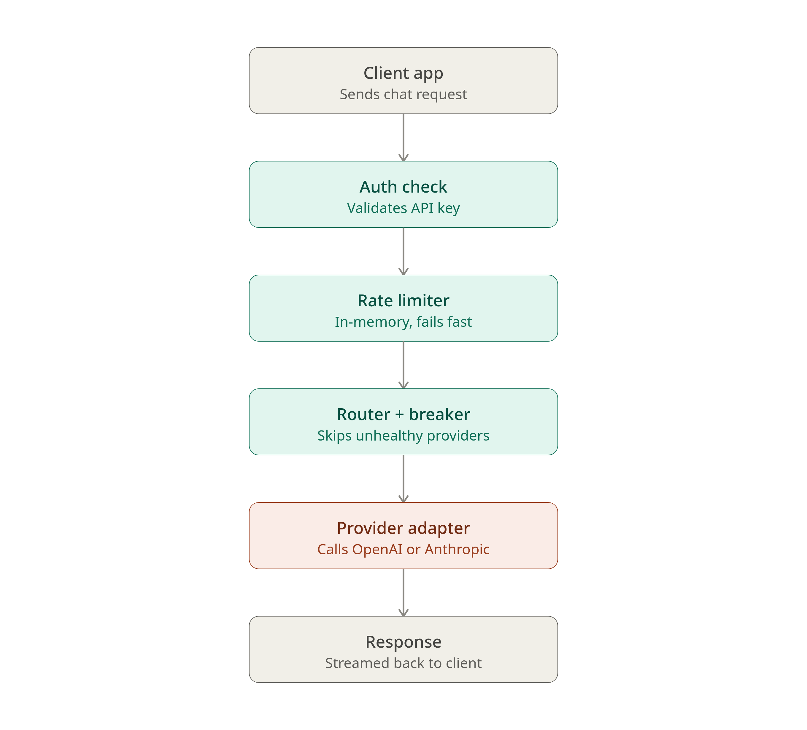

# Relayix 

A FastAPI-native gateway that sits in front of your LLM providers: multi-provider routing with circuit-breaker failover, token-based cost accounting, and rate limiting.

## Overview

Relayix is a FastAPI-native gateway that sits in front of your LLM providers. Instead of application code calling OpenAI, Anthropic, or other providers directly, it calls Relayix — which handles routing between providers, fails over automatically when one is having issues, enforces rate limits, and tracks token-based cost per request.
 
The goal is to centralize the concerns that would otherwise be duplicated in every app that talks to an LLM: which provider to use, what to do when one goes down, how many requests a caller can make, and what everything actually costs.


 
**Core capabilities:**
 
- **Multi-provider routing** — requests are routed across configured providers based on availability and strategy.
- **Circuit-breaker failover** — unhealthy providers are automatically taken out of rotation and periodically re-tested, so an outage on one provider doesn't fail requests for your users.
- **Token-based cost accounting** — token usage and cost are recorded per request, queryable after the fact.
- **Rate limiting** — requests are throttled per API key before they reach a provider.
Full technical documentation — architecture, request flow, storage design, and the circuit breaker state machine — lives separately from this README.
 

---

## Architecture 

```
relayix/
├── app/
│   ├── main.py                      # FastAPI app entrypoint
│   │
│   ├── api/
│   │   ├── v1/
│   │   │   ├── chat.py              # /v1/chat/completions router
│   │   │   ├── usage.py             # usage/cost query endpoints
│   │   │   └── health.py            # health + circuit breaker status
│   │   └── schemas/
│   │       ├── request.py
│   │       └── response.py
│   │
│   ├── core/
│   │   ├── adapters/
│   │   │   ├── base.py              # ProviderAdapter interface
│   │   │   ├── openai_adapter.py
│   │   │   ├── anthropic_adapter.py
│   │   │   └── registry.py          # provider registry/factory
│   │   │
│   │   ├── routing/
│   │   │   ├── router.py            # RoutingService
│   │   │   └── strategies.py        # priority / cost-based / latency-based
│   │   │
│   │   ├── resilience/
│   │   │   ├── circuit_breaker.py   # state machine
│   │   │   └── store.py             # in-memory state (Redis later)
│   │   │
│   │   ├── ratelimit/
│   │   │   ├── limiter.py
│   │   │   └── store.py
│   │   │
│   │   └── accounting/
│   │       ├── token_counter.py     # per-provider tokenizers
│   │       ├── pricing.py           # pricing tables
│   │       └── usage_recorder.py
│   │
│   ├── services/
│   │   └── gateway_service.py       # orchestrates the full pipeline
│   │
│   ├── repositories/
│   │   ├── usage_repository.py
│   │   ├── api_key_repository.py
│   │   └── pricing_repository.py
│   │
│   ├── models/
│   │   ├── domain/                  # dataclasses / internal models
│   │   └── db/                      # ORM models
│   │
│   ├── middleware/
│   │   ├── auth.py
│   │   └── logging.py
│   │
│   └── config.py
│
├── tests/
│   ├── unit/
│   │   ├── test_circuit_breaker.py
│   │   ├── test_routing.py
│   │   └── test_accounting.py
│   └── integration/
│       └── test_chat_endpoint.py
│
├── pyproject.toml
└── README.md
```

