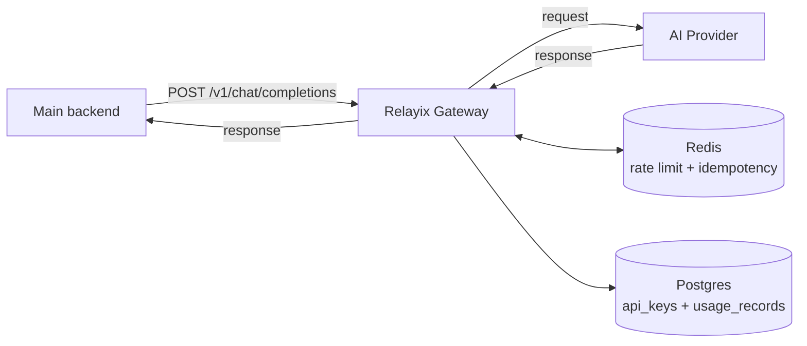

# Relayix

A FastAPI-native gateway that sits in front of your LLM providers: multi-provider routing with circuit-breaker failover, token-based cost accounting, and rate limiting.

## Overview

Relayix is a FastAPI-native gateway that sits in front of your LLM providers. Instead of application code calling OpenAI, Anthropic, or other providers directly, it calls Relayix — which handles routing between providers, fails over automatically when one is having issues, enforces rate limits, and tracks token-based cost per request.

The goal is to centralize the concerns that would otherwise be duplicated in every app that talks to an LLM: which provider to use, what to do when one goes down, how many requests a caller can make, and what everything actually costs. By moving these concerns behind a single gateway, applications stay thin and consistent, and operational policy lives in one place.

Full technical documentation — architecture, request flow, and per-module deep dives —
lives in [docs/](docs/README.md), start there.


```mermaid
flowchart LR
    A[Main backend] -- "POST /v1/chat/completions" --> B[Relayix Gateway]
    B -- response --> A
    B -- request --> G[AI Provider]
    G -- response --> B
    B <--> R[("Redis<br/>rate limit + idempotency")]
    B --> D[("Postgres<br/>api_keys + usage_records")]
```

## Features

- **Multi-provider routing** — requests are routed across configured providers based on availability and strategy.
- **Circuit-breaker failover** — unhealthy providers are automatically taken out of rotation and periodically re-tested, so an outage on one provider doesn't fail requests for your users.
- **Token-based cost accounting** — token usage and cost are recorded per request, queryable after the fact.
- **Rate limiting** — requests are throttled per API key before they reach a provider, backed by Redis with an in-memory fallback if Redis is unreachable.
- **Idempotency** — send an `Idempotency-Key` header and a retried request replays the stored response instead of hitting a provider again.
- **Streaming** — `stream: true` returns the completion as Server-Sent Events.

## Tech Stack

- **Python** / **FastAPI** — async HTTP delivery layer.
- **SQLAlchemy** / **asyncpg** — ORM and persistence.
- **Alembic** — database schema migrations.
- **Redis** — rate limiting and idempotency.
- **Docker** — containerized build and deployment.

## Running locally

```bash
cp .env.example .env       # fill in provider keys and ADMIN_API_TOKEN
poetry install
make up                    # Postgres + Redis in Docker
make run                   # migrations, then uvicorn --reload on the host
```

See `Makefile` for the rest (`make test`, `make migrate`, `make revision`, ...).

## Deployment

Every push to `main` runs the test suite and, on success, builds and pushes the
image to `ghcr.io/maximoberth0/relayix` (see `.github/workflows/ci.yml`).
Rolling a new tag out on the box is manual — see the deploy notes at the top
of `docker/docker-compose.prod.yml`. Start the box's `.env` from
`env.production.example`.

## Project Structure

```
relayix/
├── app/
│   ├── main.py            # FastAPI entrypoint: app wiring, lifespan, error handler
│   │
│   ├── api/               # HTTP delivery layer: versioned routers, schemas, deps
│   │   ├── v1/            # /v1 endpoints (chat, usage, health) + request/response schemas
│   │   └── deps.py        # shared FastAPI dependencies (auth, injected services)
│   │
│   ├── core/              # provider-agnostic business logic (no HTTP, no DB)
│   │   ├── adapters/      # per-provider clients behind one ProviderAdapter interface
│   │   ├── routing/       # tier → candidate resolution and ranking strategies
│   │   ├── resilience/    # circuit breaker and failover state
│   │   ├── ratelimit/     # per-key rate limiting
│   │   └── accounting/    # token counting, pricing tables, usage recording
│   │
│   ├── services/          # orchestration: composes core into the request pipeline
│   │
│   ├── repositories/      # persistence access for usage, api keys and pricing
│   │
│   ├── models/            # internal data models
│   │   ├── domain/        # domain dataclasses / internal models
│   │   └── db/            # ORM models
│   │
│   ├── infra/             # framework glue: config, base exceptions
│   │   ├── security/      # crypto / hashing helpers
│   │   ├── database/      # engine, session and ORM base
│   │   ├── ratelimit/     # Redis client and Redis-backed limiter
│   │   └── idempotency/   # Redis-backed idempotency store
│   │
│   └── observability/     # logging setup and request-id middleware
│
├── alembic/               # migrations
├── docker/                # Dockerfile + compose stacks (dev, test and prod)
├── docs/                  # architecture docs, start at docs/README.md
├── tests/                 # unit and integration suites
├── pyproject.toml
└── README.md
```

## License

This project is licensed under the MIT License.
