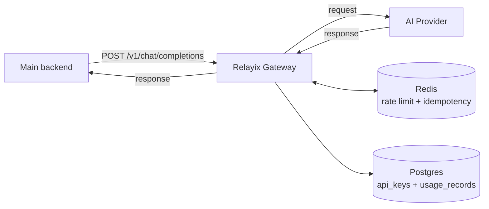
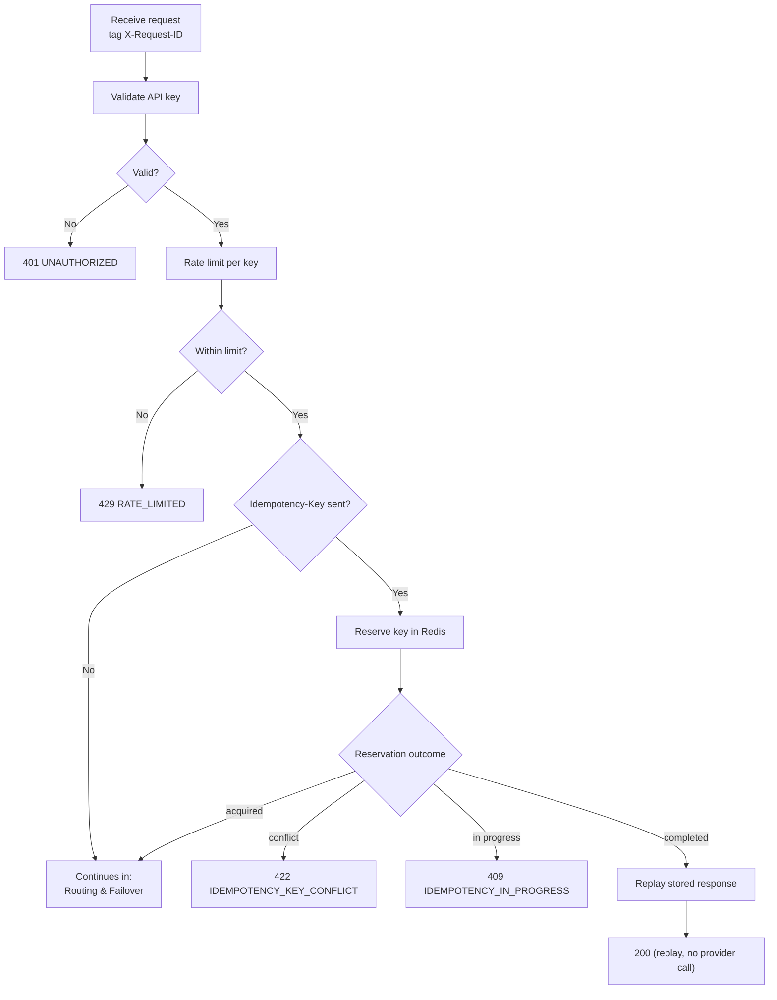
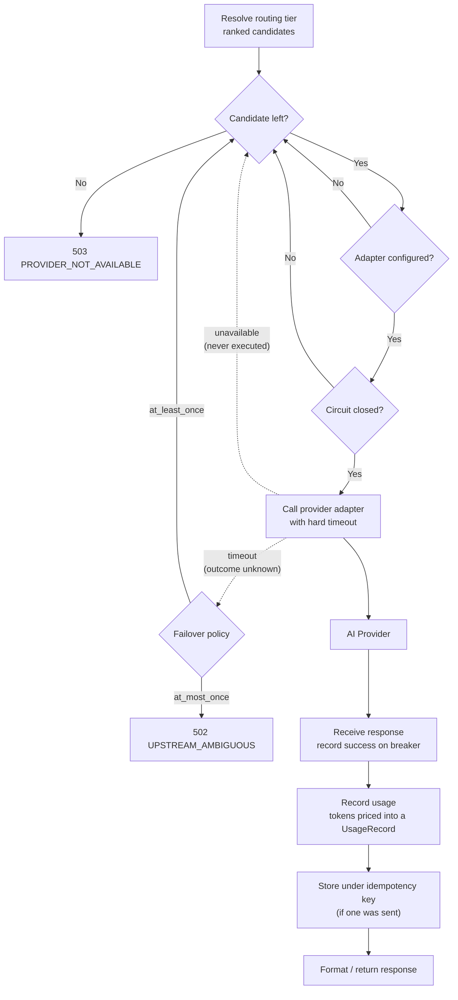

## System flow

The request path is split into two stages: **admission** (is this caller allowed, and
have we already answered this exact request?) and **routing & failover** (which provider
serves it, and what happens when one fails).

### High-level flow

### 1. Admission

Authenticate, throttle, and short-circuit repeated requests before any provider is touched.

### 2. Routing & failover

Try ranked candidates in order; skip the ones that can't serve, fail over on the ones that fail.

**Why the two dotted edges differ:** an *unavailable* provider provably never ran the
request, so failing over is always safe. A *timeout* is ambiguous — the request may have
executed and billed — so failing over is gated on the caller's `failover_policy`, which
defaults to `at_most_once` (no double-spend).
